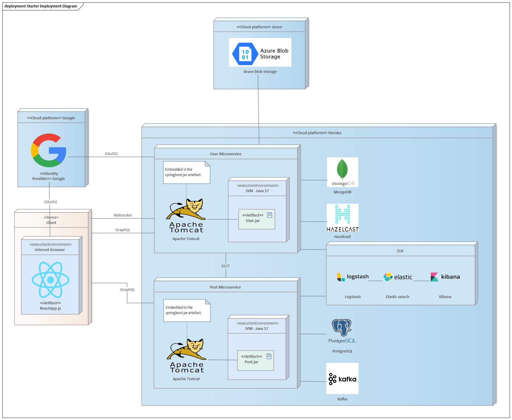

# Úvod

Aplikace je ořezaný klon Instagramu, který umožňuje přidávat příspěvky s obrázky, ty pak komentovat a likovat. Dál aplikace umožňuje jednotlivým uživatelům spolu chatovat.

Aplikaci jsme vyvinuli s použitím mikroservisní architektury.

# Lokální vývoj

1. Běž do rootu projektu a spusť
   - S ELK službama: `docker compose up`
   - Bez ELK: `docker compose -f docker-compose-noelastic.yml up`
2. Spusť main User modulu a main Post modulu
3. Při zapnutí se samy nainicializují testovací data
4. Pro obejití přihlášení lze poslat jako JWT token řetězec "admin", "belkapre", "bureson2", "pivonja1", "naplava", "koci", "sebekji1" a "nagyoing"

# Použité technologie a kde je najít v projektu

- **Docker** - Pro lokální vývoj jsem používali docker-compose (v rootu projektu)
- **Graphql** - Obě dvě microservices vystavují pro FE GraphQL API (resources/graphql, graphql package v User a Post)
- **REST** - Pro komunikaci mezi mikroservisama. (User/rest, Post/rest)
- **Azure Blob Storage** - použili jsme pro ukládání obrázků, FE dostává pak link na místo v Azure Storage (Post/service/FileService)
- **MongoDB** - (Post/model, Post/repository)
- **Scheduling** - Pravidelné mazáni cache. (Post/service/CacheService)
- **Hazelcast** - Autentikaci v systému provádí User mikroservisa. Pokud chce Post mikroservisa zjistit, kdo posílá dotaz, tak se ji musí zeptat. Výsledek tohoto dotazu jsme se rozhodli zacachovat. (Post/rest/UserMicroserviceImpl, metoda fetchUserFromUserMicroservice)
- **Interceptors** - Logujem příchozí dotazy (Post/interceptor, User/interceptor)
- **OAUth2** - Aplikace využívá google login. (User/security)
- **Websocket** - K messaging nám poslouží i websocket (User/config).
- **Kafka** - použili jsme pro messaging, je vytvořený topic "onegram" (User/service).
- **ELK** - pouižili jsme pro loggovaní. Přes docker-compose se vytvoří elastic search, kibana a logstash. Logování pomocí Slf4j.lombok.
- **React** - (frontend)

# Použité design patterny
- **Simple factory** - Vytváření objektů pro testování. (User/test/environment/Generator, Post/test/environment/Generator)
- **Builder** - Pomocí @Builder anotace z Lombok. (Post/service/SysteminitializerImpl)
- **Composite** - Model Post mikroservisy je strom (Příspěvek -> komenty -> subkomenty). Pro každý uzel tohoto stromu je potřeba jednotný interface pro vytvoření/smazání liku. (Post/model/interfaces/Likeable).
- **Ghost** - Komenty, příspěvky a liky mají svého autora. Autor patří do bounded contextu User mikroservisy. Příspěvek, koment a like do bounded contextu Post mikroservisy. Autor se nenačítá hned přímo, ale pouze se na něj odkazuje idčkem.
- **Dependency Injection** - Spring.

# Deployment

User mikroservisu jsme s Postgre nasadili na Heroku. Zbytek včetně FE není nasazený. Po přihlášení lze z URL vytáhnout JWT token a provolat API User mikroservisy. [Odkaz na Heroku](http://nss-onegram.herokuapp.com/).

Obrázek popisuje způsob, jakým bychom deploynuli appku celou.

# Co jsme zkusili použít ale nedotáhli do konce, protože se nám to nepovedlo

Původně jsme chtěli jako vstupní bod pro aplikaci použít API Gateway pattern. To se nám ale nakonec nepodařilo a nedodělali jsme to. Chtěli jsme pro to použít Spring Cloud Gateway.

V plánu jsme chtěli mít i naimplementované identity providera na API-Gateway, ale k tomu jsme se nedostali.

Nejsme si jistí jestli využíváme správně Kafku, neboť máme jeden topic a ty zprávy jdou broadcastove všem listenerům.

Nejsme si jistí, jestli máme spravně nakonfigurovaný ELK. Milanovi funguje, ostatní si myslíme, že nám se možná chová aplikace divně, protože máme pomalé počítače. (např. nam v lozích vypisuje info o tom, že operace s elasticem zabírají příliš mnoho času)
